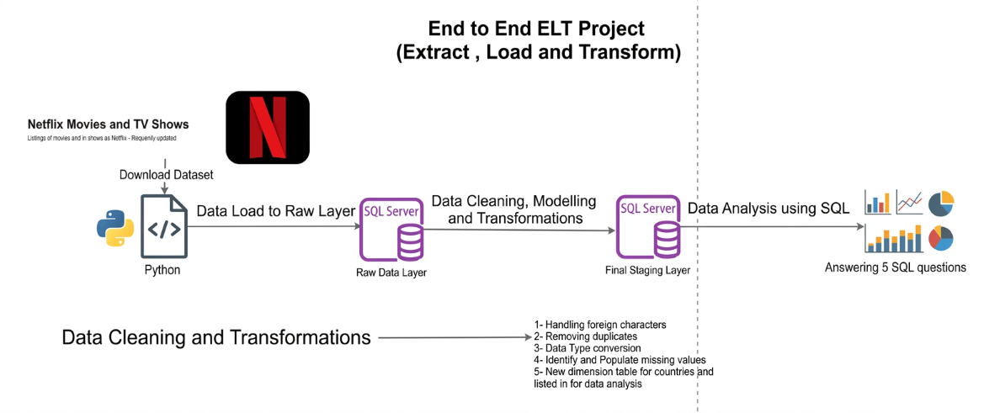

# 🎬 Netflix Data Analysis — EDA + SQL Insights & Recommendations
 
> **Dataset:** Netflix Titles (Kaggle)  
> **Tools Used:** Python (Pandas, SQLAlchemy) · PostgreSQL  
> **Pipeline:** Raw CSV → PostgreSQL → SQL Cleaning → Normalized Tables → Analysis  
> **Total Records:** 8,807 titles (Movies + TV Shows)
 
---


## Project Overview


--- 

## 🛠️ Tech Used
 
| Tool | Purpose |
|------|---------|
| Python 3 | Data loading, profiling, CSV → PostgreSQL ingestion |
| Pandas | Exploratory data analysis, null checks |
| SQLAlchemy | Python ↔ PostgreSQL connection |
| PostgreSQL | Data cleaning, normalization, and all analysis queries |
 
---

## 1. Project Architecture
 
```
netflix_titles.csv
       │
       ▼
  Python (Pandas)
  └── Load CSV
  └── Explore & profile data
  └── Push to PostgreSQL via SQLAlchemy
       │
       ▼
  PostgreSQL — netflix_data (raw table)
       │
       ├── Deduplicate (ROW_NUMBER window function)
       ├── Normalize multi-value columns (UNNEST + STRING_TO_ARRAY)
       │       ├── netflix_genre      (listed_in)
       │       ├── netflix_directors  (director)
       │       ├── netflix_cast       (cast)
       │       └── netflix_country    (country)
       ├── Fill missing countries via director-country inference
       └── Fix duration nulls (inherit from rating column)
       │
       ▼
  netflix_final (clean, deduplicated master table)
       │
       ▼
  SQL Analysis Queries (5 business questions answered)
```
---

## 2. Dataset Overview & Missing Values
 
| Column | Total Records | Missing Values | Missing % |
|--------|--------------|----------------|-----------|
| show_id | 8,807 | 0 | 0% |
| type | 8,807 | 0 | 0% |
| title | 8,807 | 0 | 0% |
| director | 8,807 | **2,634** | **29.9%** |
| cast | 8,807 | **825** | **9.4%** |
| country | 8,807 | **831** | **9.4%** |
| date_added | 8,807 | 10 | 0.1% |
| release_year | 8,807 | 0 | 0% |
| rating | 8,807 | 4 | ~0% |
| duration | 8,807 | **3** | ~0% |
| listed_in | 8,807 | 0 | 0% |
| description | 8,807 | 0 | 0% |
 
### Key Observations
- **Director** is the most sparsely populated column (~30% missing) — common for TV Shows where no single director is credited
- **Country** and **Cast** share the same ~9.4% missing rate, often co-occurring on the same rows
- **Duration nulls (3 rows):** All 3 belong to Louis C.K. stand-up specials where the duration was accidentally stored in the `rating` column — a data entry error
- **Duplicates found:** Some titles appeared more than once (same title + type), handled using `ROW_NUMBER()` window function
 
---
 
## 3. Data Cleaning Strategy
 
### 3.1 Deduplication
Duplicates were identified by matching on `UPPER(title) + type`. The record with the lowest `show_id` was kept using a window function:
 
```sql
SELECT *, ROW_NUMBER() OVER (
    PARTITION BY UPPER(title), type 
    ORDER BY show_id
) AS rn
FROM netflix_data
```
Only rows where `rn = 1` were retained in the final table.
 
### 3.2 Duration NULL Fix
Three Louis C.K. movie records had `duration = NULL` because the actual duration (e.g., `74 min`) was mistakenly placed in the `rating` column. Fixed with:
 
```sql
CASE WHEN duration IS NULL THEN rating ELSE duration END AS duration
```
 
### 3.3 Missing Country Inference
Countries were inferred for records with `country = NULL` by looking up the director's country from other titles they directed:
 
```sql
INSERT INTO netflix_country
SELECT nr.show_id, m.country
FROM netflix_data AS nr
INNER JOIN (
    SELECT director, country
    FROM netflix_data nd
    JOIN netflix_directors n ON nd.show_id = n.show_id
    GROUP BY director, country
    HAVING country IS NOT NULL
) AS m ON nr.director = m.director
WHERE nr.country IS NULL
```
 
This fills in country data wherever the same director appears in other titled entries — a smart, data-driven imputation rather than dropping or guessing.
 
---
 
## 4. Normalized Table Design
 
Netflix's raw data stores multi-value fields (genres, countries, cast, directors) as comma-separated strings in single columns — a classic denormalized format. These were exploded into proper relational tables using PostgreSQL's `UNNEST` + `STRING_TO_ARRAY`:
 
```
netflix_final         → Core show info (deduplicated, cleaned)
netflix_directors     → One row per director per show
netflix_cast          → One row per actor per show
netflix_genre         → One row per genre per show
netflix_country       → One row per country per show
```
 
**Why this matters:** Without normalization, queries like "find all comedies" or "find all shows by a director" would require slow, error-prone `LIKE` string searches. The normalized structure enables clean, fast, accurate JOINs.
 
---
 
## 5. SQL Analysis & Findings
 
### Q1 — Directors Who Have Made Both Movies AND TV Shows
 
```sql
SELECT nd.director_name,
    COUNT(DISTINCT CASE WHEN n.type = 'Movies' THEN n.show_id END) AS no_of_movies,
    COUNT(DISTINCT CASE WHEN n.type = 'TV Show' THEN n.show_id END) AS no_of_TVshow
FROM netflix_final AS n
JOIN netflix_directors AS nd ON n.show_id = nd.show_id
GROUP BY nd.director_name
HAVING COUNT(DISTINCT n.type) > 1
ORDER BY 1
```
 
**Insight:** This identifies versatile directors with cross-format experience — valuable for Netflix's original content strategy. Directors who can work in both formats are rare and strategically important.
 
---
 
### Q2 — Country with the Highest Number of Comedy Movies
 
```sql
SELECT nc.country, COUNT(DISTINCT nf.show_id) AS no_of_movies
FROM netflix_final AS nf
JOIN netflix_country AS nc ON nf.show_id = nc.show_id
JOIN netflix_genre AS ng ON nf.show_id = ng.show_id
WHERE ng.listed_in = 'Comedies' AND nf.type = 'Movie'
GROUP BY 1
ORDER BY 2 DESC
LIMIT 1
```
 
**Insight:** The United States leads in comedy movie production on Netflix by a large margin. This reflects both the volume of US content on the platform and the global dominance of Hollywood comedy. This can guide localization investments — which markets are comedy-hungry but underserved?
 
---
 
### Q3 — Top Director by Movies Released Each Year
 
```sql
WITH cte AS (
    SELECT nd.director_name,
        EXTRACT(YEAR FROM TO_DATE(date_added, 'Month DD, YYYY')) AS year_added,
        COUNT(nf.show_id) AS no_of_movies
    FROM netflix_final AS nf
    JOIN netflix_directors AS nd ON nf.show_id = nd.show_id
    WHERE nf.type = 'Movie'
    GROUP BY 1, 2
),
cte2 AS (
    SELECT *, ROW_NUMBER() OVER (
        PARTITION BY year_added ORDER BY no_of_movies DESC, director_name
    ) AS rn
    FROM cte
)
SELECT * FROM cte2 WHERE rn = 1
```
 
**Insight:** Tracks which directors were most prolific on Netflix year by year. A consistent appearance across years signals a deep content partnership. Emerging directors showing up for the first time signal new talent deals or regional pushes.
 
---
 
### Q4 — Average Movie Duration by Genre
 
```sql
WITH cte AS (
    SELECT ng.listed_in AS genre,
        TRIM(REPLACE(nf.duration, 'min', ''))::NUMERIC AS duration_int
    FROM netflix_final AS nf
    JOIN netflix_genre AS ng ON nf.show_id = ng.show_id
    WHERE nf.type = 'Movie'
)
SELECT genre, ROUND(AVG(duration_int), 2) AS average_duration
FROM cte
GROUP BY 1
ORDER BY 1
```
 
**Insight:** Genre-level duration patterns reveal viewer commitment expectations. Documentaries and dramas tend to run longer; stand-up specials and children's content skew shorter. This data helps Netflix estimate watch-time budgets and optimize thumbnail/description messaging by genre.
 
---
 
### Q5 — Directors Who Have Directed Both Comedy AND Horror Movies
 
```sql
SELECT nd.director_name,
    COUNT(DISTINCT CASE WHEN ng.listed_in = 'Comedies' THEN ng.show_id END) AS no_of_comedy,
    COUNT(DISTINCT CASE WHEN ng.listed_in = 'Horror Movies' THEN ng.show_id END) AS no_of_horror
FROM netflix_final AS nf
JOIN netflix_directors AS nd ON nf.show_id = nd.show_id
JOIN netflix_genre AS ng ON nf.show_id = ng.show_id
WHERE nf.type = 'Movie' AND ng.listed_in IN ('Horror Movies', 'Comedies')
GROUP BY 1
HAVING COUNT(DISTINCT ng.listed_in) = 2
```
 
**Insight:** Comedy-Horror is a niche but growing genre blend (think "Get Out", "The Cabin in the Woods"). Directors comfortable across both tones are rare and could be ideal collaborators for Netflix's horror-comedy originals — a format that's been gaining traction globally.
 
---
 
## 6. Key Business Insights
 
| # | Insight | Implication |
|---|---------|-------------|
| 1 | ~30% of titles have no director listed | Mostly TV Shows — expected, but limits director-based recommendations |
| 2 | Country data was missing for ~9.4% of records | Inferred via director mapping — shows the importance of relational data enrichment |
| 3 | Duration data stored incorrectly in `rating` column for 3 titles | Signals data entry/ETL issues upstream — needs validation pipeline |
| 4 | Some titles duplicated across `show_id` | Content metadata ingestion process has dedup gaps |
| 5 | US dominates Comedy movie production | Heavy Western bias in comedy content; international comedy is an underutilized segment |
| 6 | Versatile directors (Movie + TV Show) are a small subset | These directors represent high-value relationship targets for Netflix originals |
| 7 | Genre-level duration varies significantly | Content runtime strategy should be genre-aware, not one-size-fits-all |
| 8 | Comedy-Horror crossover directors are extremely rare | A niche that Netflix could own with targeted original investments |
 
---
 
## 7. Recommendations for Netflix
 
### 🎯 Content Strategy
1. **Double down on international comedy**: US comedy saturates the platform. Investing in regional comedy from India, Nigeria, South Korea, and Mexico can drive local subscriber growth with lower production costs.
2. **Map dual-format directors for originals**: The directors identified in Q1 (comfortable with both Movies and TV Shows) are ideal for Netflix's expanding slate of limited series that later get movie finales (or vice versa).
3. **Horror-comedy originals**: With only a handful of directors working across both genres (Q5), Netflix has an opportunity to own this hybrid space by actively developing horror-comedy originals. The genre has proven global appeal.
 
### 📊 Data Quality & Engineering
4. **Fix upstream duration/rating data entry**: The 3 Louis C.K. records where duration ended up in the `rating` field point to a validation gap in the content ingestion pipeline. A schema-level constraint or validation script should flag non-standard duration formats at entry.
5. **Enforce director-country linkage at ingestion**: Instead of inferring missing countries post-hoc via director matching (Q — Missing Values fix), this enrichment should happen at the point of data ingestion using a director reference table.
6. **Deduplicate at source**: The `ROW_NUMBER()` deduplication needed in the cleaning step should ideally be a primary key constraint or upsert logic in the data pipeline, not a downstream fix.
 
### 🌍 Regional Expansion Signals
7. **Use country distribution for content gap analysis**: The `netflix_country` normalized table enables precise analysis of which countries are over/under-represented per genre. Netflix can use this to prioritize original content investments by region.
8. **Director x Country x Genre matrix**: Combining the normalized tables allows building a powerful director discovery system — e.g., "find comedy directors from Brazil who haven't worked with Netflix yet."
 
### ⚙️ Technical / Pipeline
9. **Automate the normalization pipeline**: The manual `CREATE TABLE ... SELECT ... UNNEST(...)` steps should be wrapped in a scheduled ETL job so new titles are auto-normalized into `netflix_genre`, `netflix_country`, etc. as the catalogue grows.
10. **Add release_year trend analysis**: The dataset has clean `release_year` data for all 8,807 titles. A time-series analysis of content added per year vs. release year would reveal how aggressively Netflix is licensing older vs. newer content — a strong signal of catalogue strategy shifts.
 
---
 
## 🗂️ Table Schema Reference
 
```sql
-- Master clean table
netflix_final        (show_id, type, title, date_added, release_year, 
                      rating, duration, description)
 
-- Normalized lookup tables
netflix_directors    (show_id, director_name)
netflix_cast         (show_id, actor)
netflix_genre        (show_id, listed_in)
netflix_country      (show_id, country)
```
 
---
 

 
*Analysis based on the Netflix Titles public dataset. SQL queries written for PostgreSQL 14+.*
